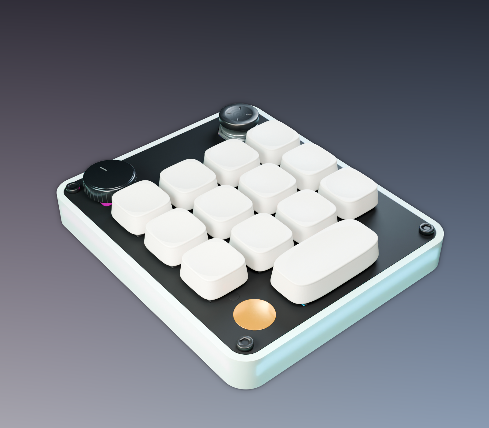
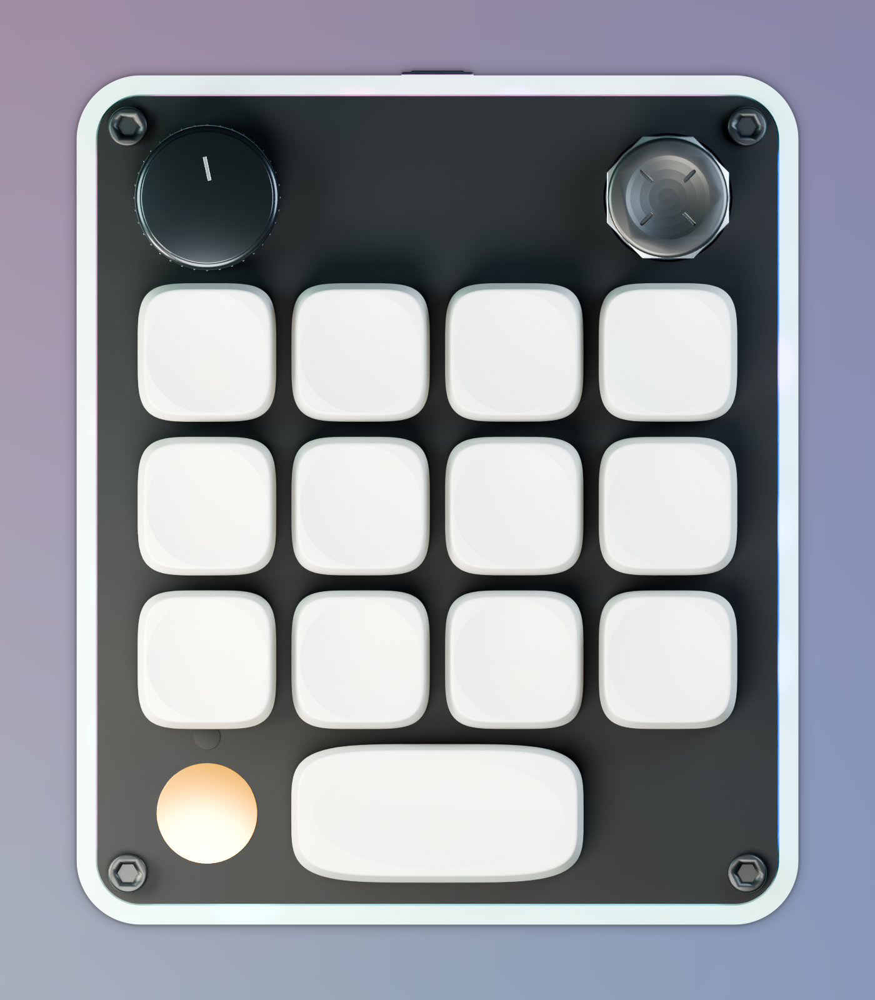

# agentpad13

Open-source 13-key macropad for agentic work — in the spirit of the Work Louder
Creator Micro 2 / OpenAI Codex Micro, built from scratch. Bare RP2040, USB-C,
12×1U + 1×2U hot-swap keys, clickable EC11 rotary encoder, analog 2-axis tilt
joystick, a capacitive-touch key, and a 24-LED RGB chain (per-key + edge
underglow) driven over Raw HID by an open agent-status protocol
(thinking / running / waiting / done, one key per agent).

> **Want one? [HOW-TO-ORDER.md](HOW-TO-ORDER.md) — start here to build one.**
> Every part has a fabrication path (and all but the assembled PCB a home
> path): pick a build tier and follow the cards.

<p align="center">
  
  
</p>

<p align="center"><sub>Case concept: frosted RGB-diffusing band, matte-black FR4 plate, and printed tray.</sub></p>

## Status

- **PCB: v5 — COMPLETE.** Finished and fabrication-ready (details below). v5
  corrects the board versus Rev A: the **encoder is repositioned** so its shaft
  centers under the case plate's encoder opening, the **USB-C receptacle's
  orientation is corrected** (mouth to the case wall aperture), and the
  **joystick is now a fab-placed YA13 tilt gimbal** with datasheet-verified
  wiring.
- **Case: v2.5 — COMPLETE.** FR4 plate-as-deck + printed tray, matched to the
  v5 board. Three plate variants (exposed ENIG **gold-disc** touch marker /
  tented disc with silk ring / blank no-copper), plus **printable toppers**
  (encoder knobs + stick caps in fit ladders) and an **optional PORON gasket
  kit**. Print files (STL/STEP) and orderable plate fab files under
  `hardware/case/` — see its README for print/order/assembly guidance.
- **Firmware: VALIDATED.** Emulator-boot tested, Raw HID protocol-conformant,
  and the pin map matches the v5 board (unchanged from Rev A v4 — v5 needed
  zero firmware changes).

### PCB (complete)

- **Board:** v5, **84.2 × 100 mm**, **2-layer** RP2040, 1.6 mm FR-4.
- **Features:** 13 hot-swap keys (12×1U + 1×2U) + EC11 encoder + analog YA13
  tilt joystick + capacitive touch + per-key RGB and edge underglow.
- **DRC:** clean (0 violations, 0 unconnected) at a **0.152 mm / 6-mil standard
  fab tier** (verified in KiCad 9).
- **Fab package** (`hardware/pcb/`): Gerbers + drill and per-SKU assembly
  bundles — **opaque** (underglow unpopulated) and **translucent** (underglow
  populated). The bare board is identical for both.
- **Hand-soldered afterlist:** just the rotary encoder. Everything else —
  including the through-hole joystick — is fab-placed by default (hot-swap
  sockets and tact switches are hand-solder only if you opt out).

> **Firmware note:** the firmware pin map matches the v5 board and has been
> validated — it boots in an RP2040 emulator and its Raw HID status protocol is
> conformance-tested. Build recipe and validation assets live in `firmware/`
> (`BUILD.md`, `FIRMWARE-V4-NOTES.md`, `tests/`).

> **Joystick polarity/calibration:** the fab-placed YA13 is mounted 180° from
> its datasheet datum, so both axes' direction sense read inverted out of the
> box, and the shipped config carries placeholder calibration values. Both are
> one-time, config-only fixes described in
> [`firmware/POLARITY-NOTE.md`](firmware/POLARITY-NOTE.md).

## Contents

```
HOW-TO-ORDER.md   Start here to build one: tiers, per-part order/print cards,
                  assembly order, bring-up checklist.
hardware/
  pcb/    KiCad 9 project (agentpad13.kicad_pcb/.kicad_sch/.kicad_pro), vendored
          footprint libs, final BOM, Gerbers, per-SKU assembly bundles, renders.
  case/   v2.5 case for the v5 board: FR4 plate-as-deck + printed band/tray.
          STL/STEP print files, three orderable plate variants
          (.kicad_pcb/.dxf + gerber zips), printable toppers (encoder knobs +
          stick caps), optional gasket kit. See hardware/case/README.md.
firmware/
  loudest_micro/  vial-qmk keyboard tree (RP2040, direct-pin, ENCODER_MAP,
                  analog joystick modes, Raw HID status protocol).
  prebuilt/       Flashable UF2s (default + vial), built per BUILD.md.
  POLARITY-NOTE.md  Joystick axis-sense + calibration config note (v5).
  BUILD.md        Reproducible toolchain + build recipe.
```

## Licensing

- `hardware/` — **CERN-OHL-W-2.0** (schematic, PCB, case CAD).
- `firmware/` — **GPL-2.0-or-later** (QMK/vial-qmk derivative). Corresponding
  source for the prebuilt UF2s = this tree built against
  [vial-qmk](https://github.com/vial-kb/vial-qmk) per `firmware/BUILD.md`.

Vendored footprint libraries under `hardware/pcb/lib/` keep their upstream
licenses (marbastlib: CERN-OHL-P v2; MX_V2: MIT) — see `hardware/pcb/lib/LIBS.md`.

Built from scratch; not affiliated with Work Louder or OpenAI.
