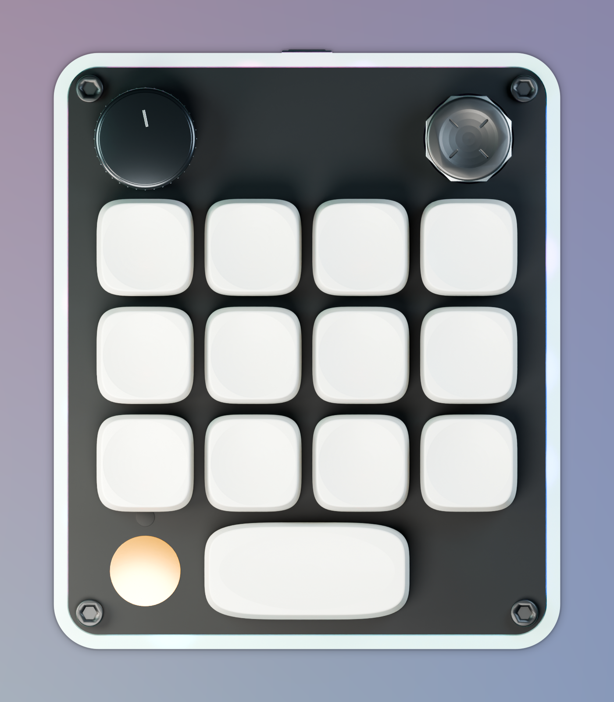

# agentpad13

Open-source 13-key macropad for agentic work, built from scratch. Bare RP2040, USB-C,
12×1U + 1×2U hot-swap keys, clickable EC11 rotary encoder, analog 2-axis tilt
joystick, a capacitive-touch key, and a 24-LED RGB chain (per-key + edge
underglow) driven over Raw HID by an open agent-status protocol
(thinking / running / waiting / done, one key per agent).

> **Want one? [`release/HOW-TO-ORDER.md`](release/HOW-TO-ORDER.md) — start here to build one.**
> Every part has a fabrication path (and all but the assembled PCB a home
> path): pick a build tier and follow the cards.

<p align="center">
  
  
</p>

<p align="center"><sub>Case concept: frosted RGB-diffusing band, matte-black FR4 plate, and printed tray.
<b>Concept art only</b> — drawn against the earlier thin band; the shipping band has a
<b>5.4 mm sidewall</b> (95.6 × 111.4 mm outside), as in the CAD renders below.</sub></p>


<p align="center"><sub>Assembled v5 board in the v2 case, straight from the CAD model — 5.4 mm band
(5.3 mm visible rim), FR4 plate deck, encoder NW, YA13 tilt stick NE, USB-C on the north wall.
Six-view turntable: <a href="release/renders/v27_turntable.png"><code>release/renders/v27_turntable.png</code></a>.</sub></p>

## Read this first if you have already printed toppers

> **The v1 encoder knobs and stick caps are retired. If you printed one, print it
> again.** Two of the changes are fit corrections rather than taste. The old Ø18
> knob never quite covered the plate's encoder opening — it left a 0.310 mm
> sliver showing at two corners — and it was too short for the shaft on your
> board. Every v2 knob is **Ø19.0**, tops out at **+27.0**, and seats the
> encoder shaft **uncut**.
>
> The family is now **three knobs and two stick parts**. Knobs **A**
> (helical knurl), **B2** (scooped top) and **C** (cross hatch) are one size in
> three bores — Ø5.9 `tight` / Ø6.0 `nom` / Ø6.1 `loose`; print `nom` first. The
> four v1 stick caps are replaced by two parts that do different jobs: the
> **Ø6.19 dot nub**, which is clear of the neighbouring 2U keycap at the full
> 30° throw and needs no restrictor, and the **one-piece TPU puck**, whose
> integral 22.5° cone land *is* the restrictor — print that one in **TPU ~95A**.
>
> The full reasoning, the measurements behind it, and the Bourns shaft-length
> caveat are in [`release/RELEASE.md`](release/RELEASE.md) **§(f)**.

## What is where

The orderable, printable, flashable bundle lives in **`release/`** — one
directory you can hand to a fab or a printer. The engineering sources it was
built from stay at the repository root, where they have always been.

```
release/          THE BUNDLE — everything you order, print or flash.
  HOW-TO-ORDER.md   Start here: tiers, per-part order/print cards, assembly
                    order, bring-up checklist.
  RELEASE.md        What shipped and why, section by section (§(f) = toppers).
  MANIFEST.md       Every file in the bundle with its md5 and byte count.
  hardware/         Board fab package, case STL/STEP, plate variants, bases,
                    keycaps, toppers v2, gasket kit.
  firmware/         Flashable UF2s + BRING-UP.md + POLARITY-NOTE.md.
  renders/          Product and CAD renders.

configurator/     BUILD YOUR OWN — a static site that draws the pad you
                  configured and prints the order sheet for it.

hardware/
  pcb/    KiCad 9 project (agentpad13.kicad_pcb/.kicad_sch/.kicad_pro), vendored
          footprint libs, final BOM, renders.
firmware/
  loudest_micro/  vial-qmk keyboard tree (RP2040, direct-pin, ENCODER_MAP,
                  analog joystick modes, Raw HID status protocol).
  sim/            Behavioral simulation of the shipped UF2 on rp2040js — the
                  referee that caught the touch-polarity defect, and that proves
                  the calibration survives a power cycle.
  tests/          Raw HID conformance suite + RP2040 emulator boot test.
  BUILD.md        Reproducible toolchain + build recipe.
docs/
  PROTOCOL-V1-CONTRACT.md  The Raw HID wire protocol, including the joystick
                  calibration commands — the spec both the firmware and the
                  conformance suite are written against.
  topper-candidates.html   The topper design review, as it was decided.
manifest_selfverify.py     Proves release/MANIFEST.md is true of the bundle.
```

**Verify the bundle before you send anything to a fab:**

```sh
python3 manifest_selfverify.py     # -> RESULT: 9/9 checks PASS
```

Nine checks, both directions: every listed file is present with the right md5
and byte count, *and* no unlisted file is hiding in the bundle.

## The configurator

`configurator/` is a build-your-own page: pick a band wall, a plate variant, a
base, keycaps and toppers, see the result in 3D, and get back an order sheet
whose every line deep-links into `release/`. It is plain static files — no build
step, no network calls, no dependencies to install — so it runs from a checkout:

```sh
python3 -m http.server            # from the repository root
# then open http://localhost:8000/configurator/site/
```

Serve it from the **repository root**, not from inside `configurator/`: the
order sheet's links are repo-root-relative so that every part you pick is one
click from the file you hand to the fab. The same property makes it deployable
as a GitHub Pages site straight out of the repository.

`configurator/build/` is the pipeline that generates the site's data. Every byte
it emits is derived from files that ship in `release/` and is gated against
`release/MANIFEST.md` — nothing is re-run through CAD and nothing is typed in by
hand.

## Status

- **PCB: v5 — COMPLETE.** Finished and fabrication-ready (details below). v5
  corrects the board versus Rev A: the **encoder is repositioned** so its shaft
  centers under the case plate's encoder opening, the **USB-C receptacle's
  orientation is corrected** (mouth to the case wall aperture), and the
  **joystick is now a fab-placed YA13 tilt gimbal** with datasheet-verified
  wiring. The board shipped here is **v5_7**, which additionally **turns the two
  bottom-edge underglow LEDs around** (they were aimed off the board instead of
  under it) — two footprint rotations, no part or net changes. The LEDs beside the
  USB connector still face outward on purpose. See
  [`hardware/pcb/README.md`](hardware/pcb/README.md) §Board revision.
- **Case: v2.17 — COMPLETE.** FR4 plate-as-deck + printed tray, matched to the
  v5 board. Three plate variants (exposed ENIG **gold-disc** touch marker /
  tented disc with silk ring / blank no-copper), the band in **three gated
  sidewall thicknesses** (3.0 / **5.4 default** / 7.4 mm — same part inside,
  different outside), plus **printable keycaps**, the **v2 toppers** (three
  encoder knobs + two stick parts, each in a fit ladder) and an **optional
  PORON gasket kit**. Print files (STL/STEP) and orderable plate fab files are
  under `release/hardware/`; `release/HOW-TO-ORDER.md` is the guide.
- **Bases: COMPLETE.** Three optional printed bases — `riser`, `wedge` (8°) and
  `pedestal` — all clipping into the same four pockets in the tray underside.
  The case is complete without one.
- **Firmware: VALIDATED, and rebuilt since Rev A — reflash before you judge a
  board.** Emulator-boot tested, Raw HID protocol-conformant, and the pin map
  matches the v5 board (unchanged from Rev A v4 — v5 needed zero *pin*
  changes). The shipped UF2s have moved three times since Rev A: a
  **capacitive-touch polarity fix** (the board straps the TTP223 active-high,
  but the Rev-A binaries read that pin active-low, so the pad booted with the
  touch key stuck pressed — it jumped straight to the second layer and the touch
  key then triggered on finger-lift), an **isotropic RGB layout fix** (the four
  geometry-based animations were drawn into a 4:1-distorted coordinate space),
  and **on-board joystick calibration** — the board now calibrates its own stick
  from a button press and remembers it, so the joystick no longer ships stuck on
  placeholder values you cannot change. The encoder direction was also corrected
  against a real assembled board (clockwise was turning the volume *down*), and
  Vial now exposes the encoder for remapping. All fixed in
  `release/firmware/prebuilt/` as shipped here.
- **The prebuilt UF2s were renamed.** Flash **`agentpad13.uf2`** — that is the
  Vial build and the one you want. `agentpad13_reference.uf2` is the same
  firmware without live remapping, kept because it rebuilds byte-for-byte from
  this tree, so anyone can verify what is shipped. The old
  `loudest_micro_*.uf2` names, including the separate `calibrate` build, are
  **gone**.

### PCB (complete)

- **Board:** v5, **84.2 × 100 mm**, **2-layer** RP2040, 1.6 mm FR-4.
- **Features:** 13 hot-swap keys (12×1U + 1×2U) + EC11 encoder + analog YA13
  tilt joystick + capacitive touch + per-key RGB and edge underglow.
- **DRC:** clean (0 violations, 0 unconnected) at a **0.152 mm / 6-mil standard
  fab tier** (verified in KiCad 9).
- **Fab package** (`release/hardware/pcb/`): Gerbers + drill and per-SKU assembly
  bundles — **opaque** (underglow unpopulated) and **translucent** (underglow
  populated). The bare board is identical for both.
- **Hand-soldered afterlist:** just the rotary encoder. Everything else —
  including the through-hole joystick — is fab-placed by default (hot-swap
  sockets and tact switches are hand-solder only if you opt out).

> **Firmware note:** the firmware pin map matches the v5 board and has been
> validated — it boots in an RP2040 emulator, its Raw HID status protocol is
> conformance-tested, and a behavioral simulation drives the shipped UF2 through
> every switch, the encoder, the touch key's real board polarity, the joystick
> ADC and all 24 LEDs. Build recipe and validation assets live in `firmware/`
> (`BUILD.md`, `FIRMWARE-V4-NOTES.md`, `tests/`, `sim/`).

> **First power-on — you need a USB cable and nothing else.** Flash
> `release/firmware/prebuilt/agentpad13.uf2` (hold BOOTSEL, drag the file on), then
> **hold SW14 — the same button in the back — for about a second and follow the
> lights.** The 13 key LEDs are the whole interface: white means armed, a blue
> bar fills while the board finds where your stick rests, an amber-to-green bar
> fills while you roll the stick around its outside edge, and all 13 flash green
> when it has stored the result. About 15 seconds. The calibration lives in the
> board's own memory and survives unplugging *and* reflashing, so you do this
> once, ever. The keyboard keeps working the whole time, and pressing SW14 again
> cancels without changing anything.
>
> **No host software is involved at any point** — no daemon, no CLI, no driver,
> no second firmware to flash and un-flash, no editing source and rebuilding.
> The full procedure, including what to do if it flashes red, is
> [`release/firmware/BRING-UP.md`](release/firmware/BRING-UP.md).
>
> **Joystick polarity** is a separate, rarer thing: the fab-placed YA13 is
> mounted 180° from its datasheet datum, so an axis can read *reversed*.
> Calibration records where the stick's ends **are**; polarity is which end is
> **which**. If a direction feels backwards, that is still a one-line config
> edit and a rebuild — see
> [`release/firmware/POLARITY-NOTE.md`](release/firmware/POLARITY-NOTE.md).

## Licensing

- `hardware/` and `release/hardware/` — **CERN-OHL-W-2.0** (schematic, PCB, case CAD).
- `firmware/` and `release/firmware/` — **GPL-2.0-or-later** (QMK/vial-qmk
  derivative). Corresponding source for the prebuilt UF2s = this tree built
  against [vial-qmk](https://github.com/vial-kb/vial-qmk) per
  `firmware/BUILD.md`.

Vendored footprint libraries under `hardware/pcb/lib/` keep their upstream
licenses (marbastlib: CERN-OHL-P v2; MX_V2: MIT) — see `hardware/pcb/lib/LIBS.md`.
