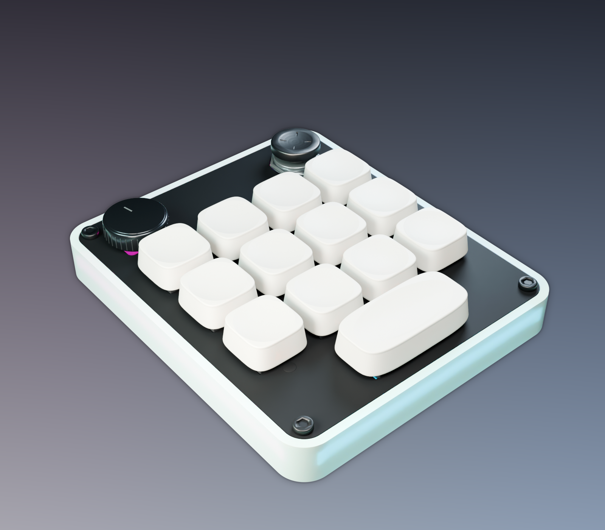
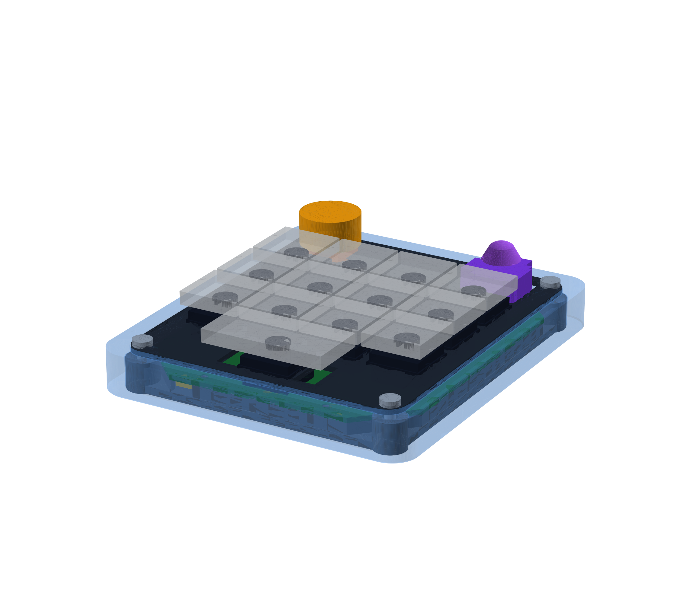

# agentpad13

A 13-key macropad for agentic work, designed from scratch: RP2040, USB-C, 12×1U + 1×2U hot-swap
keys, a clickable EC11 encoder, an analog tilt joystick, a capacitive-touch key, and 24 RGB LEDs
(per-key plus edge underglow) that an open Raw HID protocol drives to show what your agents are
doing — thinking, running, waiting, done, one key each.

## Build one

### → [Open the configurator](https://yuz207.github.io/agentpad13/configurator/site/)

Pick your options, turn the pad around in 3D, and get back an order sheet where every line links to
the exact file you upload to a fab or drop into a slicer. That is the way in. Prefer paper?
[`release/HOW-TO-ORDER.md`](release/HOW-TO-ORDER.md) is the same thing, static.

<p align="center">
  
  
</p>

<p align="center"><sub>Left: product concept, drawn against an earlier and thinner band.
Right: the shipping v5 board in the v2 case, straight from the CAD.</sub></p>

## What is where

```
release/            The bundle — everything you order, print or flash.
  HOW-TO-ORDER.md     The configurator's static form.
  RELEASE.md          What shipped and why, section by section.
  MANIFEST.md         Every file in the bundle with its md5 and byte count.
  hardware/           Board fab package, case, plate, bases, keycaps, toppers, gasket.
  firmware/           Flashable UF2s, BRING-UP.md, POLARITY-NOTE.md.
configurator/       The site above, plus the pipeline that generates its data.
hardware/pcb/       KiCad 9 project, vendored footprint libs, BOM, renders.
firmware/           vial-qmk tree, simulations, conformance tests, BUILD.md.
docs/               The Raw HID protocol contract, and the design reviews.
```

Before you send anything to a fab, run `python3 manifest_selfverify.py` — it should print
**9/9 checks PASS**. Every listed file is present with the right hash, and nothing unlisted is
hiding in the bundle.

## Printed toppers already? Print them again

The v1 encoder knobs and stick caps are retired: the old Ø18 knob never covered the plate's encoder
opening and was too short for the shaft on your board. The family is now three Ø19 knobs and two
stick parts. The reasoning and the measurements are in [`release/RELEASE.md`](release/RELEASE.md) §(f).

## Status

- **PCB — complete.** v5_7, 84.2 × 100 mm, 2-layer, DRC clean, fab package ready to upload.
- **Case — complete.** v2.17: FR4 or printed plate, band in three sidewalls, printed tray.
- **Bases — complete.** Three optional printed bases; the case is finished without one.
- **Firmware — validated.** Emulator-booted and protocol-conformant. Flash `agentpad13.uf2`.
- **Configurator — live.** Static files: no build step, no network calls, no dependencies.

### AgentPad13 Direct OAI (experimental alternative)

The isolated `codex_oai` keymap is an experimental alternative for direct
Codex Desktop control. It is not Vial firmware and does not replace the normal,
recommended `release/firmware/prebuilt/agentpad13.uf2`. Codex Desktop talks to
this target directly—no helper, daemon, bridge, or Vial protocol—using the
locked `Codex Micro Lab OAI LED` identity (`303A:8360`, usage `FF00:61`, Report
ID 6, 64-byte reports).

The current unflashed candidate is
`release/firmware/prebuilt/agentpad13_codex_oai.uf2`, 93,696 bytes, SHA-256
`fcb50b2419419be43b7cf90b00a96b16063fcaf182bc24b9642d57e2e8adf54d`.
Start with the [keymap contract](firmware/loudest_micro/keymaps/codex_oai/README.md),
[source hand-off](firmware/CODEX-OAI-SOURCE.md), and
[Direct OAI build procedure](firmware/BUILD.md#agentpad13-direct-oai-experimental-alternative).
Run the complete host suite from the repository root:

```sh
python3 -m unittest discover -s firmware/tests/codex_oai -p 'test_*.py'
```

The checked-in [emulator capture](firmware/evidence/codex-oai-emulator.json)
and [current manifest](firmware/evidence/codex-oai-current-manifest.json) bind
that exact UF2 to the offline USB/protocol/LED checks. Physical validation is
still entirely PENDING; no install or flash occurred. Any future hardware
operation requires the literal authorization and observation record in the
[physical runbook](docs/codex-oai-physical-runbook.md).

## First power-on

Flash [`agentpad13.uf2`](release/firmware/prebuilt/agentpad13.uf2) — hold BOOTSEL and drag the file on. Then hold
SW14, the button in the back, for about a second and follow the 13 key LEDs: the board measures its
own joystick and stores the result. About 15 seconds, no host software, no reflash, once ever —
full procedure in [`release/firmware/BRING-UP.md`](release/firmware/BRING-UP.md). If an axis reads
backwards that is polarity, not calibration:
[`release/firmware/POLARITY-NOTE.md`](release/firmware/POLARITY-NOTE.md).

Firmware source is in [`firmware/loudest_micro/`](firmware/loudest_micro/); the exact Vial/QMK
build recipe and validation commands are in [`firmware/BUILD.md`](firmware/BUILD.md). The plain-QMK,
byte-reproducible build is [`agentpad13_reference.uf2`](release/firmware/prebuilt/agentpad13_reference.uf2).

## Licensing

- `hardware/` and `release/hardware/` — **CERN-OHL-W-2.0** (schematic, PCB, case CAD).
- `firmware/` and `release/firmware/` — **GPL-2.0-or-later** (QMK/vial-qmk
  derivative), except `firmware/tests/conformance/protocol_oracle.py`, which is
  **MIT**. Corresponding source for the prebuilt UF2s = this tree built against
  [vial-qmk](https://github.com/vial-kb/vial-qmk) per `firmware/BUILD.md`.

Vendored footprint libraries under `hardware/pcb/lib/` keep their upstream
licenses (marbastlib: CERN-OHL-P v2; MX_V2: MIT) — see `hardware/pcb/lib/LIBS.md`.
